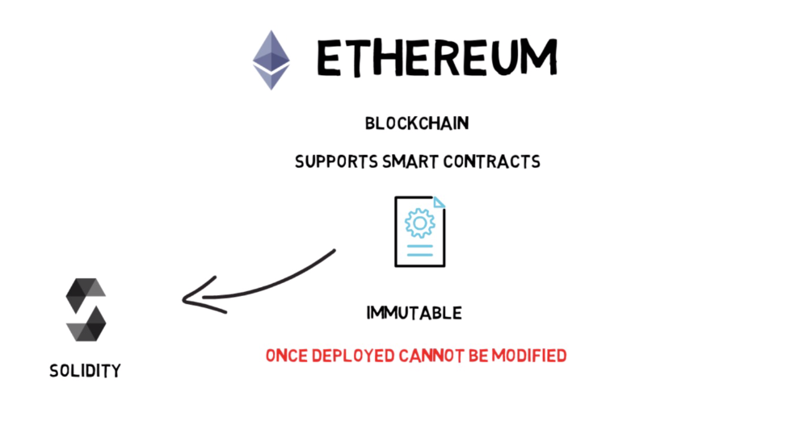
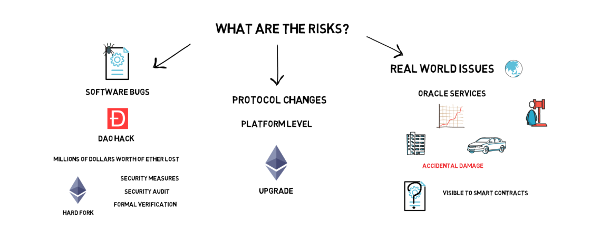
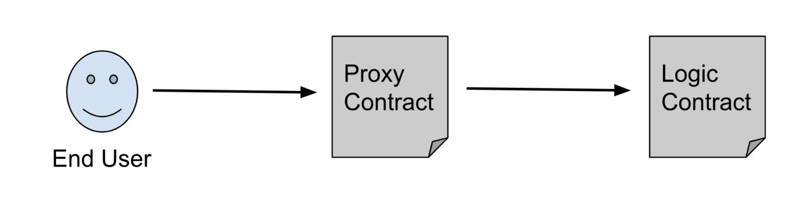
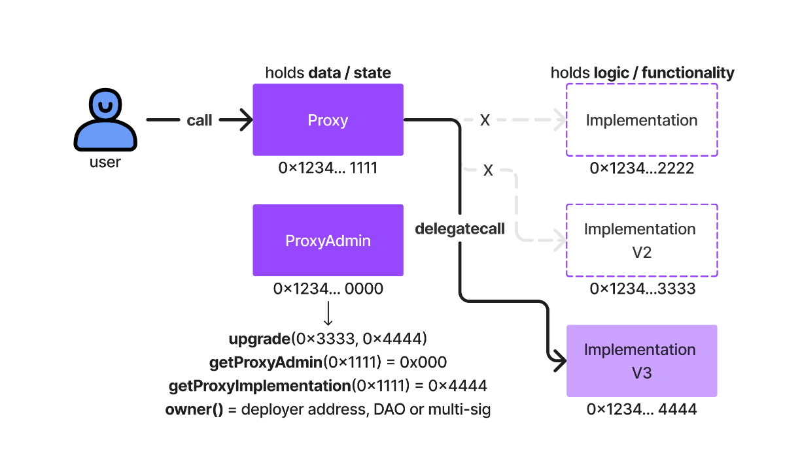

## Upgradeable Smart Contracts in Solidity: A Practical Guide with Hardhat and OpenZeppelin

Blockchain technology is perhaps one of the most striking inventions of the digital age. Smart contracts, known for their immutability and reliability, are among the foundational building blocks of this technology. However, the inherent nature of contracts being immutable has posed some challenges over time.



In the early days of the blockchain world, smart contracts, once written and approved, seemed as permanent as engravings on stone. However, this feature became both an advantage and a disadvantage over time. As technology rapidly evolved, smart contracts couldn't keep up with the pace of change.

Upon reflection, when you look back at the initial steps of blockchain, you may recall that things were a bit simpler back then. The first smart contracts were perfect for representing immutable assets like real estate. However, as time passed, things became more complex, projects grew, user needs changed, and it's precisely at this point that "upgradable contracts" and "proxies" come into play.

So, why is this so exciting? Because it signifies a revolution in the blockchain world. Smart contracts will no longer be cast aside once written. You'll be able to update them, making them smarter and more flexible. As the world changes, so will your contracts. Think of it as a superhero for our code, making it more adaptable and harmonious.



However, as we contemplate these new features, naturally, some questions arise. Will upgradable contracts compromise the principle of immutability? This is where the infamous DAO Hack incident comes into play. If you recall, the event that split the Ethereum community and gave rise to Ethereum Classic questioned the principle that a contract cannot be altered once deployed. However, upgradable contracts and proxies aim to build the future of the blockchain world on more solid foundations, learning from such incidents.

Now, let's create an upgradable smart contract together in this article.

# **How Do Upgrades Work?**

Upgrading smart contracts is commonly achieved through a software architecture pattern called the "Proxy Pattern." In software design, the term "proxy" refers to a software component that acts on behalf of another part of the system.

This pattern consists of two main parts: a "_proxy_" contract acting on behalf of some portion of the system and a "_logic_" contract containing the actual functionality.



The proxy contract tracks the addresses of other smart contracts in the system and uses storage variables to redirect incoming traffic to the correct smart contract. However, it employs a method called **<mark>delegatecall</mark>** for this redirection. Delegatecall is a mechanism where the code at the target address is executed in the context of the calling contract.

# **Transparent and UUPS Patterns**

There are two common patterns for upgradable smart contracts: transparent proxies and upgradeable upgradeable proxies (UUPS). Both allow you to upgrade your contract, but they have some important differences in terms of security and usability.



## **Transparent Proxies**

- **How it works:** In this approach, the proxy contract directly references the logic contract, and when users interact with the proxy, the proxy forwards the called function to the logic contract. The logic contract performs the operation and returns the result to the proxy. The user receives the response from the proxy.
- **Advantages:**
  - Simple and easy to understand
  - Fast, because there is no communication channel between the proxy and the logic contract
  - The owner of the proxy contract can easily perform the upgrade operation
- **Disadvantages:**
  - Security risk exists. If an attacker becomes the owner of the proxy contract, they can replace the logic contract with a version of their own and take over the contract.
  - The address of the proxy contract cannot be changed. You must create a new proxy and redirect the logic contract to it.

## **Upgradeable Upgradeable Proxies (UUPS)**

- **How it works:** In this approach, there is an "upgrade admin" address between the proxy contract and the logic contract. This address has the authority to upgrade the contract. The proxy contract stores the upgrade admin address in addition to the logic contract. Users can interact with the contract as they please. When the upgrade admin wants to upgrade the logic contract, they send the address of the new logic contract to the proxy contract. The proxy contract records the new address and redirects subsequent operations to the new logic contract.
- **Advantages:**
  - More secure. The owner of the proxy contract cannot change the logic contract, only the upgrade admin has that authority.
  - The address of the proxy contract can be changed. The upgrade admin only needs to create a new proxy and record its address in the logic contract.
- **Disadvantages:**
  - More complex and consumes more gas than transparent proxies.
  - The upgrade admin must be a trusted address, otherwise the contract can be taken over.

### **Which pattern to choose?**

Here are some criteria to help you decide which pattern to choose:

- **Security:** If security is your top priority, then UUPS is a better choice.
- **Complexity:** If you want simplicity, then transparent proxies are a good option.
- **Gas consumption:** UUPS consumes more gas than transparent proxies.
- **Control:** In UUPS, only the upgrade admin can perform the upgrade operation, while in transparent proxies, the owner of the proxy contract can do it.

I hope this explanation has helped you understand the differences between the transparent and UUPS patterns.

**Additional notes:**

- **Transparent proxies are generally considered to be less secure than UUPS.** This is because the proxy contract owner has the ability to change the logic contract. If an attacker were to gain control of the proxy contract, they could replace the logic contract with a malicious version.
- **UUPS are generally considered to be more secure than transparent proxies.** This is because the upgrade admin is the only one who can change the logic contract. This makes it more difficult for an attacker to gain control of the contract.
- **UUPS can be more complex than transparent proxies.** This is because they require the use of an upgrade admin.
- **UUPS can consume more gas than transparent proxies.** This is because they require the use of a storage slot to store the address of the upgrade admin.

Ultimately, the best pattern for you will depend on your specific needs and requirements.

# Let's start making a Upgradable Smart Contract

We will start by deploying a contract with functions that allow us to set a value and retrieve its value. Then, with the aim of introducing additional features to this contract, we will deploy a second version by adding a new function. This way, we will upgrade the version of our contract without changing the contract address.

Let's get started.

## **Step 1: Set up Development Environment**

- Firstly, create new folder and get in.

```powershell
mkdir upgradeable-contract && cd upgradeable-contract
```

- Initialize a npm project using the following command:

```powershell
npm init -y
```

- Install necessary dependencies:

```powershell
npm i @nomiclabs/hardhat-ethers@^2.2.2 @nomiclabs/hardhat-waffle@^2.0.5 @openzeppelin/contracts-upgradeable@^4.8.2 @openzeppelin/hardhat-upgrades@^1.22.1 dotenv ethers@^5.7.1 hardhat
```

And run hardhat project with javascript:

```powershell
npx hardhat
```

## **Step 2: Setup Hardhat.config and .env**

Here we have installed the dependency `dotenv` which will be used to access secrets from the `.env` file. This is sample `.env` file:

```powershell
PRIVATE_KEY=
ETHERSCAN_API_KEY=

PROXY_V1=
PROXY_V2=

IMPLEMENTATION_ADDRESS_V1=
IMPLEMENTATION_ADDRESS_V2=
```

We are going to save proxy and implementation addreses in this file because we want to see upgradable contracts structre.

- For private key, you can get it from metamask.

To better analyze our smart contract and enhance professionalism, we will verify our proxy address. For this purpose, we will obtain an API key from BscScan. Sign up and create new project and get api key.

Now, we are setting our `hardhat.config.js` file.

```javascript
require("@nomiclabs/hardhat-waffle");
require("@nomiclabs/hardhat-etherscan");
require("@openzeppelin/hardhat-upgrades");
require("dotenv").config();
require("@nomiclabs/hardhat-ethers");

const { ETHERSCAN_API_KEY, PRIVATE_KEY } = process.env;

module.exports = {
  solidity: "0.8.11",
  networks: {
    hardhat: {},
    bscTestnet: {
      url: "https://data-seed-prebsc-1-s1.binance.org:8545/",
      accounts: [PRIVATE_KEY],
    },
  },
  etherscan: {
    apiKey: ETHERSCAN_API_KEY,
  },
};
```

## **Step 3: Create a new Upgradable Contract**

Open the `contracts` Folder and create a new file called `contractV1.sol`.

This will be out first Version of Smart Contract.

```solidity
// SPDX-License-Identifier: MIT
pragma solidity ^0.8.0;

import "@openzeppelin/contracts-upgradeable/proxy/utils/Initializable.sol";

contract contractV1 is Initializable {
    uint256 public value;

    function initialize(uint256 _value) public initializer {
        value = _value;
    }

    function setValue(uint256 _value) public {
        value = _value;
    }

    function getValue() public view returns(uint256) {
        return value;
    }
}
```

With this contract, you can set a value or get this value.

> The initialize function is similar to the constructor, but it is called when the contract is upgraded. This allows you to preserve the contract's state when you upgrade it.

In this example, the `constructor()` function is used to initialize the `logicContract` variable with the address of the logic contract. The `initialize()` function is used to upgrade the contract. When the `initialize()` function is called, the `logicContract` variable is set to the address of the new logic contract.

By using initialize instead of constructor, you can preserve the contract's state when you upgrade it. This is important for upgradable contracts, as it allows you to maintain the contract's functionality and state.

## **Step 4: Deploy Contract.**

Now is the time to write our deploy Script.  
For this we use `deployProxy()`function instead of normal deploy function.

Create a new file called `deploy.js` in the scripts folder.

```powershell
const { ethers, upgrades } = require("hardhat");

async function main() {
  const contractV1 = await ethers.getContractFactory("contractV1");
  const proxy = await upgrades.deployProxy(contractV1, [23]);
  await proxy.deployed();

  console.log(proxy.address);
}
main();
```

Now run the script with the following command:

```powershell
npx hardhat run scripts/deploy.js --network bscTestnet
```

The output should be something like this

```javascript
Compiled 2 Solidity files successfully
0x890c1689d73DB0Dd140B28AC3ABD309B124B05A3
```

Take note of the deployed contract address to our .env file, it will be useful for testing our smart contract.

```javascript
// .env file
PROXY_V1 = 0x890c1689d73db0dd140b28ac3abd309b124b05a3;
```

## **Step 5: Testing V1 Contract**

Now, we are trying our contract. Create index.js on the main folder.

```javascript
// index.js
const { ethers } = require("ethers");
require("dotenv").config();
const PRIVATE_KEY = process.env.PRIVATE_KEY;
const CONTRACT_ADDRESS = process.env.PROXY_V1;

// import the ABI of contractV1
const { abi } = require("./artifacts/contracts/contractV1.sol/contractV1.json");

// create a provider and signer to connect to the network
const provider = new ethers.providers.JsonRpcProvider(
  "https://data-seed-prebsc-1-s1.binance.org:8545/"
);

const signer = new ethers.Wallet(PRIVATE_KEY, provider);

// create an instance of the upgradeable contract
const contractV1Instance = new ethers.Contract(CONTRACT_ADDRESS, abi, signer);

const main = async () => {
  let a = await contractV1Instance.getValue();
  console.log(parseInt(a));
  let tx = await contractV1Instance.setValue(56);
  await tx.wait();
  let c = await contractV1Instance.getValue();
  console.log(parseInt(c));
};
main();
```

We are interacting with the created contract. Let's run it now.

```powershell
node index.js
```

When deploying the contract, we set the initial value to 23 in the initialize function. If everything goes well, we should see first 23, then 56.

## **Step 6: Create a V2 Contract**

Now, lets add to new features our contracts. We are setting new value and getting value. However, we can not increase to value. Lets create new function and upgrade the contract version.

Open the `contracts` Folder and create a new file called `contractV2.sol`.

This will be out second Version of Smart Contract.

```solidity
// SPDX-License-Identifier: MIT
pragma solidity ^0.8.0;

import "./contractV1.sol";

contract contractV2 is contractV1 {
    function increaseValue(uint256 _value) public {
        value += _value;
    }
}
```

Main purpose is so simple, contractV2 inherited from contractV1 and created `increaseValue()` function.

## **Step 7: Deploy V2 and Upgrade Contract**

Get in scripts file and create deployV2.js

```javascript
// deployV2.js
const { ethers, upgrades } = require("hardhat");

const proxyAddress = "YOUR_PROXY_ADDRESS";

async function main() {
  const contractV2 = await ethers.getContractFactory("contractV2");
  const upgraded = await upgrades.upgradeProxy(proxyAddress, contractV2);

  console.log(upgraded.address);
}

main()
  .then(() => process.exit(0))
  .catch((error) => {
    console.error(error);
    process.exit(1);
  });
```

We use `upgradeProxy()` function because upgradeProxy is updates previous contract with new one.

## **Step 8: Testing Upgraded V2 Contract**

Let's try `increseValue()` function. Get in index.js and change some lines.

```javascript
const { ethers } = require("ethers");
require("dotenv").config();
const PRIVATE_KEY = process.env.PRIVATE_KEY;
const CONTRACT_ADDRESS = process.env.PROXY_V1;

// import the ABI of contractV1
const { abi } = require("./artifacts/contracts/contractV2.sol/contractV2.json");

// create a provider and signer to connect to the network
const provider = new ethers.providers.JsonRpcProvider(
  "https://data-seed-prebsc-1-s1.binance.org:8545/"
);
const signer = new ethers.Wallet(PRIVATE_KEY, provider);

// create an instance of the upgradeable contract
const contractV1Instance = new ethers.Contract(CONTRACT_ADDRESS, abi, signer);

const main = async () => {
  let a = await contractV1Instance.getValue();
  console.log(parseInt(a));
  const tx = await contractV1Instance.increaseValue(25);
  await tx.wait();
  let c = await contractV1Instance.getValue();
  console.log(parseInt(c));
};
main();
```

If everything goes very well, you will see first `56` and finally `81` in the console.

We implemented different smart contracts on the same proxy address. If you go to the internal transaction section of our bscScanda proxy address. You can see contractV1 and contractV2 implementation addresses. This mine:

```javascript
PROXY_V1 = 0x890c1689d73db0dd140b28ac3abd309b124b05a3;
PROXY_V2 = 0x890c1689d73db0dd140b28ac3abd309b124b05a3;

IMPLEMENTATION_ADDRESS_V1 = 0x137d230c2e531207aebfe8c04dc3146cf974aa7c;
IMPLEMENTATION_ADDRESS_V2 = 0xc6fab85dee00350479dcfe095e2dbf1093162774;
```

If you want to verify this impleantation address, you can do this basicly:

```powershell
npx hardhat verify --network bscTestnet YOUR_IMPLEMENTATION_ADDRESS
```

# Conclusion

Yes we did it!!! 🥳🥳🥳

This explains how to use the OpenZeppelin Upgradable Smart Contract Library to upgrade contracts to the same contract address in order to fix errors and add new features to an already-deployed smart contract.

We’ve covered how to upgrade smart contracts, why we would want to, and what the emerging practices are around upgrading smart contracts.

---

<div data-node-type="callout">
<div data-node-type="callout-emoji">💡</div>
<div data-node-type="callout-text">Please remember, the best way to learn is to teach.</div>
</div>

Website: [_emreaslan.dev_](https://emreaslan.dev)

Github: [https://github.com/emreaslan7](https://github.com/emreaslan7)

Twitter: [https://twitter.com/blockenddev](https://twitter.com/blockenddev)

Linkedln: [https://www.linkedin.com/in/emreaslan7/](https://www.linkedin.com/in/emreaslan7/)
